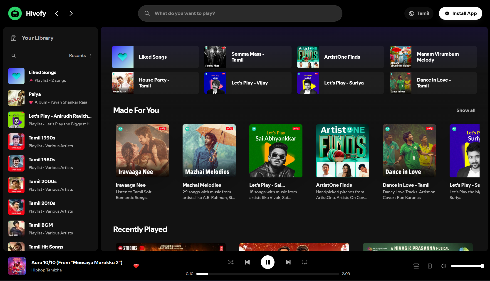
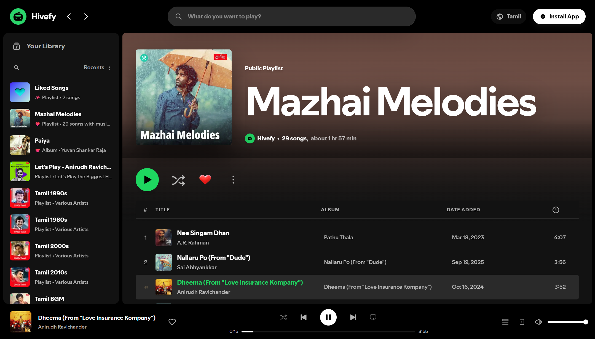
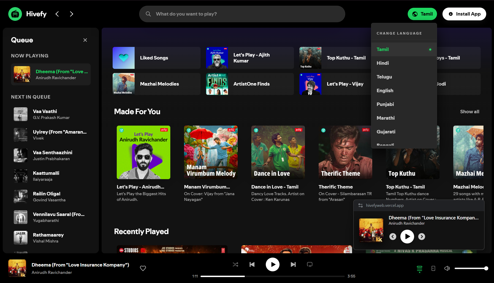

<h1 align="center">Hivefy Web 🎧</h1>

<p align="center">

  <!-- 🔹 Live Link -->
  <a href="https://hivefyweb.vercel.app">
    
  </a>

  <!-- 🔹 GitHub Stars -->
  <a href="https://github.com/Harish-Srinivas-07/hivefyweb">
    
  </a>

  <!-- 🔹 GitHub Latest Release -->
  <a href="https://github.com/Harish-Srinivas-07/hivefyweb/releases/latest">
    
  </a>

  <!-- 🔹 Built With / Platform / Open Source -->
  
  
  
  
</p>

**Hivefy Web** is the browser-based evolution of the **Hivefy Android app**. It's a **FOSS, Spotify-inspired, ad-free, and offline-ready music streaming platform** built with **Next.js** using the **unofficial JioSaavn API**.

Experience high-performance music streaming with trending charts, albums, and playlists — all **open-source, privacy-respecting, and cross-platform**. 🎵

## 🔗 Ecosystem

Hivefy is now a **multi-platform open-source music ecosystem**:

- 🌐 **Web (Next.js)** — You’re here → fast, install-free experience
- 📱 **Android (Flutter)** — Native app with offline downloads

👉 **Android Repo:** https://github.com/Harish-Srinivas-07/hivefy
👉 **Download App:** https://github.com/Harish-Srinivas-07/hivefy/releases

> Use Hivefy anywhere — browser or mobile, same philosophy: **ad-free, privacy-first music**.

<h3>Download Android App 😍</h3>

<!-- GitHub button -->
<p>
  <a href="https://github.com/Harish-Srinivas-07/hivefy/releases" target="_blank">
    
  </a>
</p>

<!-- SourceForge button -->
<p>
  <a href="https://sourceforge.net/projects/hivefy/" target="_blank">
    
  </a>
</p>

---

## ✨ Features

### 🎨 Premium Web Interface

- **Spotify-inspired UI**: Meticulously crafted layouts and smooth Spotify-like animations.
- **Easy Language Toggle**: Switch between multi-language content (Tamil, Telugu, Hindi, English, etc.) instantly from the TopBar.
- **Responsive Layout**: Designed for seamless usage across Desktop and Mobile browsers.
- **Ad-Free & Break-Free**: Enjoy your music without interruptions or advertisements.

### 🎧 Powerful Playback

- **Picture-in-Picture (PiP)**: Keep your music playing in a floating window while you work.
- **Queue Management**: Full access and control over your upcoming songs list.
- **Unlimited Shuffle**: Smart weighted shuffle for a fresh experience.
- **Media Session API**: Control playback from your system media controls or lock screen.

### 💾 Modern Features

- **Sharable Links**: Instantly copy and share direct links to songs, albums, and playlists.
- **Offline-First**: Reliable caching for a smoother, privacy-respecting experience.
- **Global Search**: Find anything instantly with a unified, debounced search bar.

---

## 🚀 Live Demo

You can try Hivefy Web live here: **[hivefyweb.vercel.app](https://hivefyweb.vercel.app/)**

---

## 🖼️ Screenshots

<p align="center">
  
</p>
<p align="center">
  
</p>

---

## 🚀 Getting Started

### Prerequisites

- Node.js **18.x** or higher
- npm / yarn / pnpm

### Setup & Run

```bash
git clone https://github.com/Harish-Srinivas-07/hivefyweb.git
cd hivefyweb
npm install
npm run dev
```

## 🧩 Tech Stack

- **Framework**: [Next.js](https://nextjs.org/) (App Router)
- **Language**: [TypeScript](https://www.typescriptlang.org/)
- **State**: [Zustand](https://github.com/pmndrs/zustand)
- **Styling**: [TailwindCSS](https://tailwindcss.com/)
- **Audio**: HTML5 Audio API & Media Session API
- **Storage**: [localForage](https://localforage.github.io/localForage/) (IndexedDB)

---

## 📱 Hivefy for Android

Prefer the native experience? Check out the original **Hivefy Android** project:

- [GitHub Repository](https://github.com/Harish-Srinivas-07/hivefy)
- [Download Releases](https://github.com/Harish-Srinivas-07/hivefy/releases)

---

## ❤️ Contributing

We welcome PRs and ideas!
If you’d like to add a feature or fix a bug, please fork the repo and open a Pull Request.

## ⚠️ Disclaimer

> Hivefy Web uses the **unofficial JioSaavn API** solely for educational and research purposes. The app **does not host or distribute** any copyrighted media. All rights belong to their respective owners.

## ⭐ Star the Repo

If Hivefy inspired you, show your support by starring ⭐ it on GitHub!
